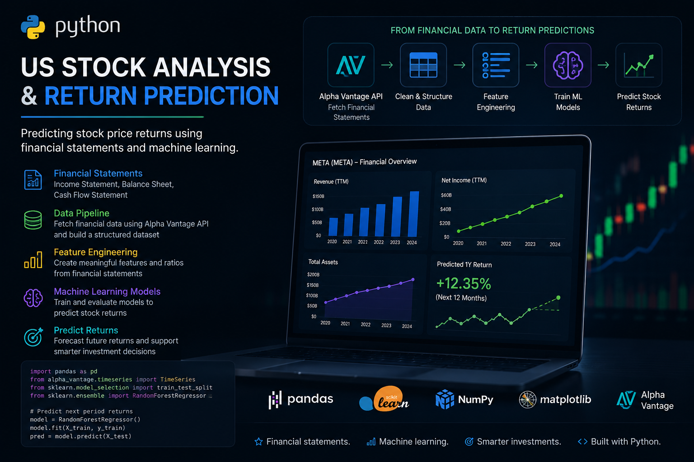

# project_stock_analysis

## Table of Contents
- [Project Motivation](#project-motivation)
- [Dataset](#dataset)
- [Requirements](#Requirements)
- [Installations](#Installations)
- [Folder description](#folder-description)
- [Result summary](#Result-summary)
- [Licensing, Authors, Acknowledgements](#Licensing-Authors-Acknowledgements)

### Project Motivation

I have always dreamt of creating my own application to analyse stocks. Instead of reading the entire financial statements of various companies or buying some bloomberg subscription, I ventured into creating my own application to analyse stocks using alpha vantage api. With this application, I can programmatically analyse any listed  stocks in the use with just button clicks. The initial part of the project is about collecting data from alpha vantage api. Second stage is performing exploratory data analysis using pandas, matplotlib and seaborn. Third stage is to create dashboard using plotly and dash which according to me is dynamic than doing all the analysis using jupyter notebook which btw is static. Fourth stage is to predict the stock returns based on the financial statements and stock price using machine learning models. Later stages will be updated on the go.

### Dataset

Data used in the project is obtained from alpha vantage api. After querying the endpoints, a local postgres database is created. More about data collection I have explained here in the [medium post](https://medium.com/me/stats/post/ecec12a8966f)

### Requirements

will be updated soon

### Installations

will be updated soon

### Folder Description

The following folders exist at the moment:
1. **alpha_vantage_api**: Contains the script required to query alpha vantage api
2. **analysis_using_pandas**: contains julyter notebook for exploratory data analysis
3. **images**: folder to save images
4. **medium**: just some images (to be ignored)
5. **polygon_api**: alternate api to query stock fundamentals (not usde at the moment)
6. **querying_using_sqlalchemy**: contains jupyter notebook to query and populate postgres database directly after querying alpha vantage api
7. **stock_db**: contains files to create database using postgres

### Result Summary

As of now, the project is moving to third stage. Till now the postgres database and exploratory data anaylsis are completed. Moving to plotly and dash right now....

### Licensing

[License](LICENSE.txt)